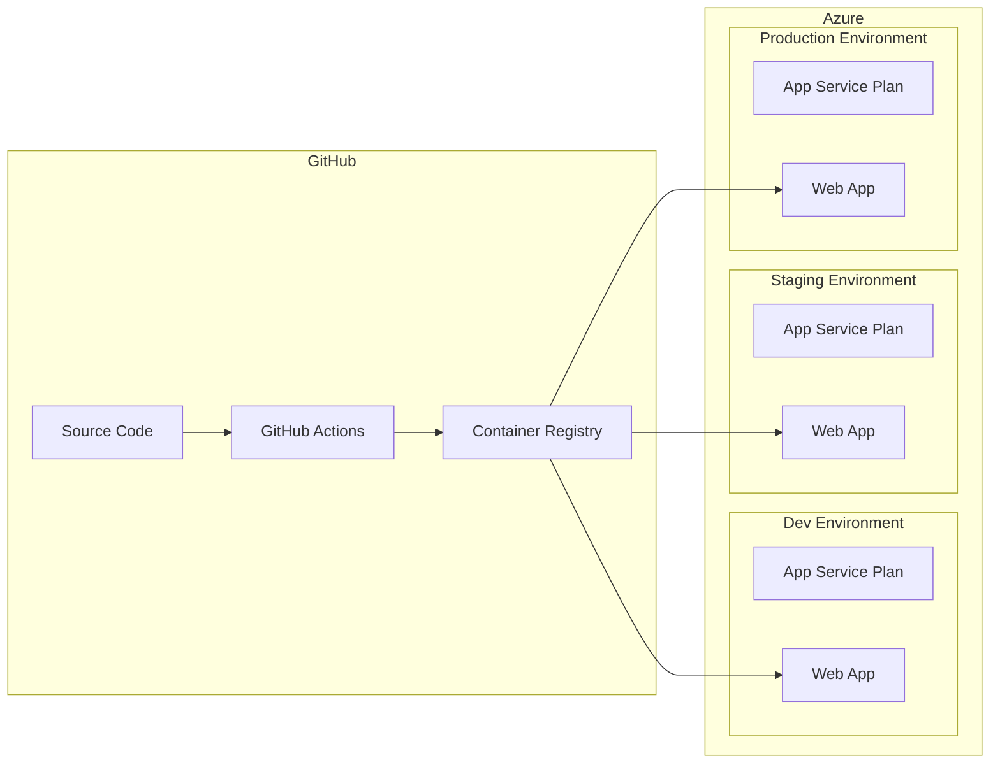

# Azure Container Deployment with Bicep and GitHub Actions

## Architecture Overview

## Files to Create

### 1. Dockerfile

Create [`Dockerfile`](Dockerfile) at the project root:

- Multi-stage build for optimized image size
- Stage 1: Install dependencies with pnpm
- Stage 2: Build the Nuxt application
- Stage 3: Production runtime with Node.js 20 Alpine
- Expose port 3000 (Nuxt default)

### 2. Docker Ignore

Create [`.dockerignore`](.dockerignore) to exclude unnecessary files from the build context (node_modules, .git, etc.)

### 3. Bicep Infrastructure

Create `infra/` directory with modular Bicep templates:

- [`infra/main.bicep`](infra/main.bicep) - Main orchestration template
  - Parameters for environment, location, app name
  - Deploys App Service Plan and Web App modules

- [`infra/modules/appServicePlan.bicep`](infra/modules/appServicePlan.bicep)
  - Linux App Service Plan
  - SKU configurable per environment (B1 for dev, S1 for staging, P1v3 for prod)

- [`infra/modules/webApp.bicep`](infra/modules/webApp.bicep)
  - Linux container Web App
  - Configure container image from GitHub Container Registry
  - Environment variables from Bicep parameters
  - Health check endpoint configuration
  - Managed identity for secure access

- [`infra/parameters/`](infra/parameters/) - Environment-specific parameter files
  - `dev.bicepparam`
  - `staging.bicepparam`
  - `prod.bicepparam`

### 4. GitHub Actions Workflows

Create `.github/workflows/` directory:

- [`.github/workflows/build.yml`](.github/workflows/build.yml)
  - Triggered on push to any branch
  - Build and push Docker image to GitHub Container Registry (ghcr.io)
  - Tag images with branch name and commit SHA

- [`.github/workflows/deploy.yml`](.github/workflows/deploy.yml)
  - Triggered on push to main (staging) or release tags (production)
  - Manual trigger option for any environment
  - Uses Azure/login action with OIDC (recommended over secrets)
  - Deploys Bicep infrastructure
  - Updates Web App with new container image

### 5. Supporting Files

- [`infra/README.md`](infra/README.md) - Documentation for infrastructure setup
  - Azure prerequisites (resource group, service principal)
  - GitHub secrets configuration
  - Manual deployment instructions

## GitHub Secrets Required

| Secret | Description |

|--------|-------------|

| `AZURE_CLIENT_ID` | Service Principal/App Registration client ID |

| `AZURE_TENANT_ID` | Azure AD tenant ID |

| `AZURE_SUBSCRIPTION_ID` | Target Azure subscription |

## Environment Configuration

Environment variables will be passed to the container via App Service configuration:

- `GEINS_API_KEY` - API key (stored as App Service secret)
- `GEINS_API_ENDPOINT` - API endpoint URL
- `NODE_ENV` - production/staging/development
- `NUXT_PUBLIC_*` - Public runtime config values

## Deployment Flow

1. **Build**: Push to any branch triggers image build and push to ghcr.io
2. **Dev**: Manual deployment via workflow dispatch
3. **Staging**: Automatic deployment on push to `main`
4. **Production**: Automatic deployment on version tags (`v*`)
