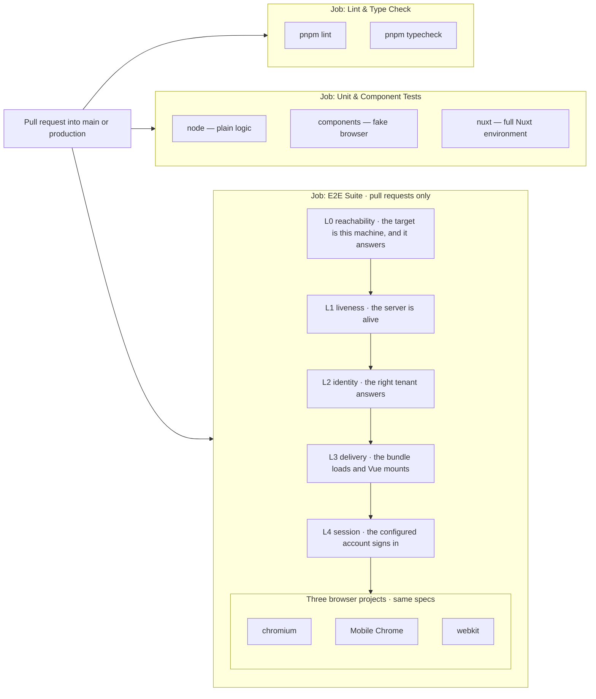
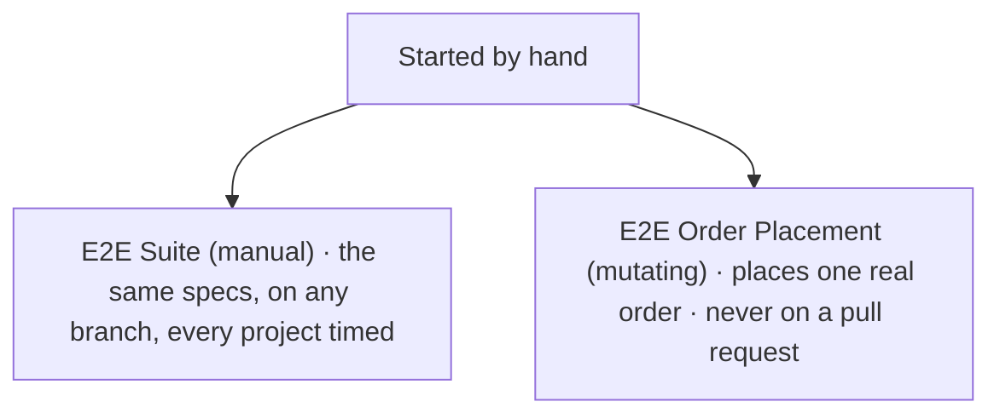
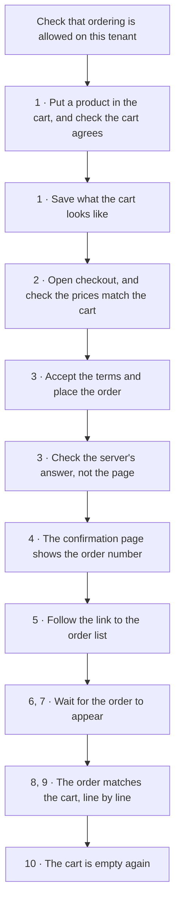
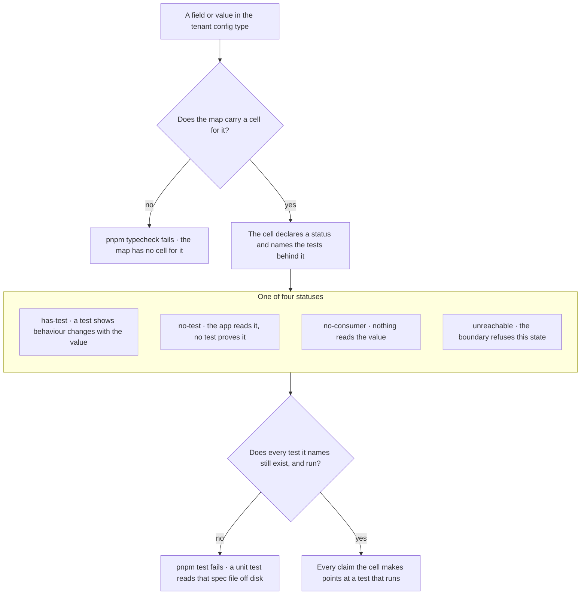
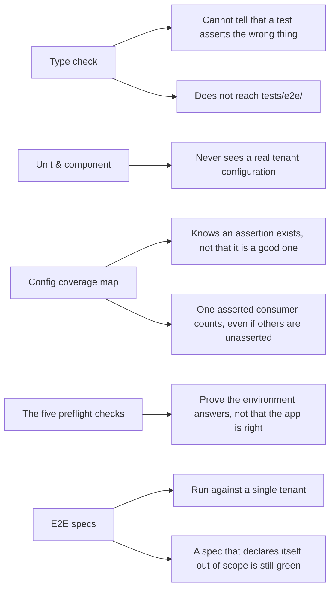

# Test layers

Five layers verify this application, and no two of them can catch the same class of defect.
This page is the map: what runs where, what each layer proves, and — the half no other
document states — what each one cannot see.

It carries no spec counts and no test counts. Those rot, and this repository has several
documented instances of exactly that. Where a number matters, the page points at the file that
fails when it drifts: `playwright.config.ts` for the browser projects,
`.github/workflows/ci.yml` for what gates, `vitest.workspace.ts` for the unit tiers.

## What runs, and when

**The five checks before the browsers.** L0 to L4 are _preflight_: cheap checks that run before
any spec, each depending on the one below it. In CI each is a step of its own, invoked with
`--no-deps`, so a red layer fails the job and the steps after it never start. The step view
names the check that broke instead of showing a wall of red specs.

**"Blocked" belongs to a different kind of run.** Where the dependencies are resolved inside one
invocation — a bare `pnpm test:e2e` locally, or the order workflow, which does not pass
`--no-deps` — Playwright never starts the tests above a failed layer, and the scope report at
the end counts them as blocked by the layer that failed. In CI there is nothing to count: the
workflow skipped those steps.

**Every spec runs on every pull request**, on all three browser projects, against a production
build served over TLS.

### Two workflows you start yourself

_E2E Suite (manual)_ runs the identical steps and continues past a red project, because three
wall-clock numbers are its deliverable where the gate's answer is settled by the first failure.
_E2E Order Placement (mutating)_ runs a separate Playwright project that the three browser
projects exclude, behind a gate that has to name the tenant it may write to.

> Every run of the suite writes to the backend — each test that builds a cart leaves one behind,
> and nothing empties them. What sets the order run apart is that its write is permanent and
> visible: an order on the test account's list, which several specs read and nothing deletes.

## What the browser specs exercise

Grouped by what a reader would go looking for, rather than by file. Every row runs in all three
browser projects on every pull request.

| Area                  | What a green run exercised                                                                                                                                                                                                                                                     | Spec                                                     |
| --------------------- | ------------------------------------------------------------------------------------------------------------------------------------------------------------------------------------------------------------------------------------------------------------------------------ | -------------------------------------------------------- |
| Browsing              | Category listing and product pages, the purchase affordance, and prices on both sides of price visibility — signed in and anonymous.                                                                                                                                           | `product-browsing`                                       |
| Cart                  | Adding from a product page and from a listing card, the cart page and the drawer, and line sums and totals compared against the cart API.                                                                                                                                      | `cart`                                                   |
| Checkout              | The summary screen, with its inc-VAT lines and totals compared against the cart API. It stops before the order is placed.                                                                                                                                                      | `checkout`                                               |
| Signing in            | The sign-in and register forms and their validation. It never signs in — that is preflight L4.                                                                                                                                                                                 | `auth`                                                   |
| Portal                | Overview, orders and order values, purchased products, saved lists and their computed total, quotations and quotation values — the value tests compare against the API that served them; the rest assert that the pages render.                                                | `portal`                                                 |
| Finding things        | Header and mobile navigation, search and the mobile search overlay, routing — including that a language switch lands on the right page and survives a hard refresh — and switching into each locale the app ships, declaring out of scope the ones this tenant does not offer. | `navigation` · `search` · `routing` · `locale-switching` |
| The tenant's own look | Theme colours reaching the page, the home page rendering and loading without console errors, and the security policy the production build sets.                                                                                                                                | `theme-colors` · `homepage` · `csp-policy`               |
| Edges                 | An unregistered hostname, plus the page basics: the tenant's own title, the header shape each viewport calls for, heading structure, the language attribute, load time.                                                                                                        | `unknown-hostname` · `app`                               |

> Placing an order is the one journey no pull request completes. It has its own project and its
> own workflow, and it writes something nothing can take back.

### The one that places an order

This is the only test that follows one purchase the whole way: from the cart, through checkout,
to the order the portal shows. The numbers are the spec's own section numbers, so the page and
the file can be read side by side.

Five things in that flow look odd until you know why they are there.

**The cart is saved before the click** because placing the order consumes it. Afterwards there
is nothing left to compare the order against, so the comparison has to be set up in advance.

**The answer from create-order is read instead of the URL.** The store swallows a failure into
an error value and never throws, so a failed order looks exactly like a page that did not
navigate. Only the response says which happened.

**The confirmation page asserts the fallback branch on purpose.** The order number is shown, the
summary box is absent, and the summary endpoint answers 502 — and the spec asserts all three.
This is not a defect being tolerated: it is the alarm. The day that endpoint starts answering,
those assertions go red and tell whoever fixed it to come back and assert the summary's own
numbers instead.

**The wait for the order to appear has a ceiling.** Exceeding it fails the test with the measured
wait, which makes the run a measurement of the platform rather than an assumption about it — the
lag is the platform's, not the app's, and a number outside the budget is a finding rather than a
flake to retry.

**Nothing reloads the page.** The row has to reach the list by itself, within a margin measured
from the moment the platform made the order readable. A reload would step around the defect that
made this test necessary, and the spec would pass while a buyer still had to refresh by hand.

Each screen is held to the API that served it, and the two API views are then held to each
other. Reading a number off one page and comparing it with another page is how two
consistent-looking renderings of one wrong number pass.

## How a config field is forced to have a test

Every value a tenant can configure has a cell in a typed map. For most of the config, a field
with no cell is not a missing test somebody might notice — it is a compile error.

Two gates, in two different commands. Neither can be satisfied by writing prose.

**The type does most of the forcing.** The map is a mapped type over each level's own `keyof`,
closed with `satisfies`, so adding a field — or a value to a union — stops the map compiling
until it has a cell. Two parts sit outside that: colours and feature keys are
`Record<string, …>` in the config type, so they are enumerated from declarations that already
exist — the colour schema for the one, the seeded defaults object for the other. A brand new nested _object_
gets a single cell until its shape is declared, which is a mapped type of about five lines.

**A reference cannot go stale.** Every reference names a spec file and a test title. A unit test
reads the spec off disk and fails if no `it`, `test` or `describe` declares that title — and
again if the declaration, or anything else in that spec, is skipped, focused or left as a todo.
A test that does not run is not coverage.

**Statuses that cannot over-claim.** `has-test` needs proof that something behaves differently
for the value, not merely that the value arrived — the vocabulary for that is _carrier_ (it
arrives), _reader_ (something derives a decision from it) and _consumer_ (behaviour changes).
`unreachable` needs both halves of its proof: that the schema rejects the value, and that the
resilient parser drops the failing leaf rather than its whole branch.

> The map may under-claim. It may not over-claim. Where two readings of a test are possible, the
> weaker one wins.

## What each layer cannot catch

This is the half no other document in the repository states, and the reason this page is worth
writing. A diagram that shows only coverage is a poster.

> The top gap is the one that has cost the most. The type check and the suite can both be green
> while a test asserts the wrong thing. That is how three portal specs passed for months — found
> by adding data to the tenant, not by reading them.

The bottom one is the same problem wearing working clothes. A spec may declare itself out of
scope with a reason, and the run stays green with fewer assertions in it. That is the honest way
to handle a tenant that cannot exercise a path — and it means a green run describes the tenant
it was pointed at, not the product.

## Which layer should a new test live in?

Pick the cheapest layer that can still fail for the right reason.

| Tier             | What belongs there                                                                                                                                                                                                           |
| ---------------- | ---------------------------------------------------------------------------------------------------------------------------------------------------------------------------------------------------------------------------- |
| `node`           | The fastest tier, and the default. Server code, stores, middleware, most composables, plain logic. Aliases and auto-imports work — the shared Vite config boots Nuxt once to produce them — but no Nuxt runtime starts here. |
| `components`     | What a component renders, and how it responds to props and events. Runs in a fake browser, not a real one.                                                                                                                   |
| `nuxt`           | Only what truly needs the Nuxt runtime: `registerEndpoint`, `mockNuxtImport`, `useNuxtApp`, `useRoute`.                                                                                                                      |
| `e2e`            | A journey across pages in a real browser, or a number a buyer sees that has to match what an API returned.                                                                                                                   |
| the coverage map | A new tenant config field or value. Not instead of a test — as well as one.                                                                                                                                                  |

> An e2e test that could have been a component test costs a browser, three projects and a minute
> of everyone's pull request.

## What "out of scope" means in the output

Every run ends with a block headed _Declared scope_. Four categories, and the difference between
them is the whole point.

| Category                | What it means                                                                                                                                                 |
| ----------------------- | ------------------------------------------------------------------------------------------------------------------------------------------------------------- |
| out of scope            | The test declared, with a reason from a closed list, that the assertion cannot be made here. The run stays green.                                             |
| ran with assertions off | The test ran, but an assertion inside it declared itself off — no CSP header on the dev server, for instance. Green, with less proven than the name suggests. |
| blocked                 | A layer the test depends on failed, so it never got its turn. Read that failure; this line is only its shadow.                                                |
| unknown                 | Skipped without declaring why. The suite does not know what it did not prove, so the run fails.                                                               |

That last row is the mechanism. A bare `test.skip` is a lint error, and a skip that reaches the
reporter undeclared turns the run red — so the suite can never quietly shrink. The reasons a
test may legitimately declare are a closed list, and adding to it means editing two files.

**Six say an assertion cannot be made:** no credentials; the feature is desktop-only and this is
the mobile project; the assertion needs the production build; the test account lacks data the
platform cannot produce yet; the target is a deployed environment on purpose; or the tenant's own
configuration never exercises this path.

**One says we chose not to:** the mutation gate — the run has not been told which tenant it may
place a real order on, so it places none.

**One of them is the dangerous one.** "The tenant's configuration does not exercise this path" is
honest and green and says nothing about any other tenant. So the reporter prints those by name,
one line per test, rather than as a count — the same treatment it gives a missing fixture and an
undeclared skip. Every other reason is summarised on a single line.

## In practice

**What to run yourself first.** `pnpm typecheck`, `pnpm test`, `pnpm lint:fix` — plus
`docker build .` when the build configuration changed, because `.dockerignore` filters the
context and the image compiles a different file set than the working tree. The full list is in
`CLAUDE.md`. Then run `pnpm test:e2e` against the dev server: that is the one mode nothing else
covers, since every workflow here tests the production build.

**Where to look when it is red.** The step view names the layer — a red preflight step says the
environment broke before any spec ran. Below that, the scope report lists what declared itself
out of scope, what ran with assertions off, and what is simply unknown. When a spec
times out, read the `preview-log` artifact before touching the spec: the server may not have
answered at all.

## See also

- [Testing](/testing) — how to run each layer, the fixtures, and the e2e target
- [ADR-023](/adr/023-config-coverage-layers) — why config coverage is asserted at unit level and
  e2e assertions are derived from the tenant's own config
- [Contributing → The documentation site](/guide/contributing#the-documentation-site) — how to
  read these diagrams rendered, locally
