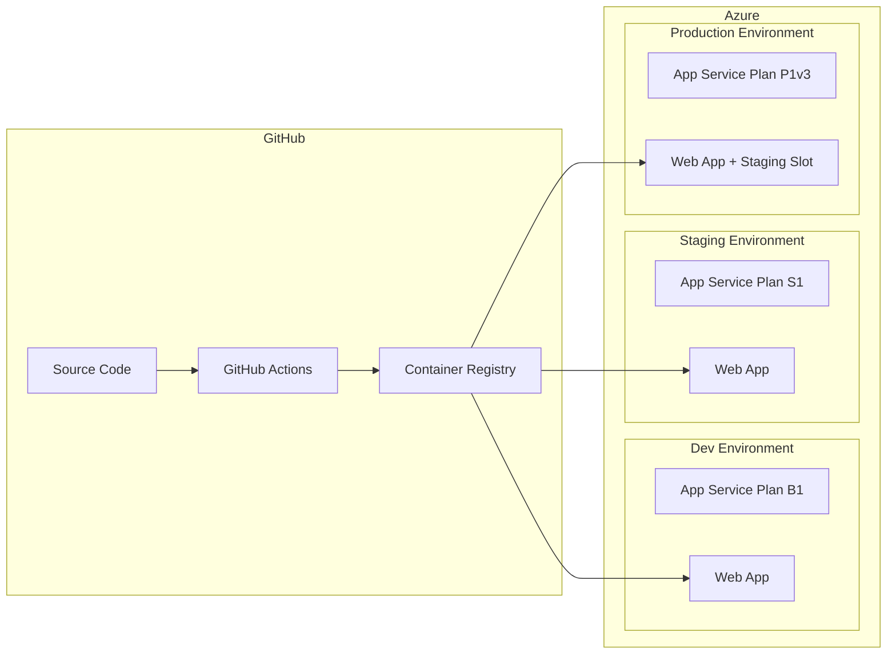

# Sales Portal Infrastructure

This directory contains the Infrastructure as Code (IaC) for deploying the Sales Portal application to Azure using Bicep templates.

## Architecture Overview



## Directory Structure

```
infra/
├── main.bicep                    # Main orchestration template
├── modules/
│   ├── appServicePlan.bicep      # App Service Plan module
│   └── webApp.bicep              # Web App module
├── parameters/
│   ├── dev.bicepparam            # Development parameters
│   ├── staging.bicepparam        # Staging parameters
│   └── prod.bicepparam           # Production parameters
└── README.md                     # This file
```

## Prerequisites

### Azure Setup

1. **Azure Subscription**: An active Azure subscription
2. **Resource Groups**: Create resource groups for each environment:

   ```bash
   az group create --name rg-sales-portal-dev --location westeurope
   az group create --name rg-sales-portal-staging --location westeurope
   az group create --name rg-sales-portal-prod --location westeurope
   ```

3. **Service Principal with Federated Credentials** (recommended for OIDC):

   ```bash
   # Create App Registration
   az ad app create --display-name "sales-portal-github-actions"

   # Get App ID
   APP_ID=$(az ad app list --display-name "sales-portal-github-actions" --query "[0].appId" -o tsv)

   # Create Service Principal
   az ad sp create --id $APP_ID

   # Get Object ID
   OBJECT_ID=$(az ad sp list --filter "appId eq '$APP_ID'" --query "[0].id" -o tsv)

   # Assign Contributor role to resource groups
   az role assignment create --assignee $OBJECT_ID --role "Contributor" --scope "/subscriptions/{subscription-id}/resourceGroups/rg-sales-portal-dev"
   az role assignment create --assignee $OBJECT_ID --role "Contributor" --scope "/subscriptions/{subscription-id}/resourceGroups/rg-sales-portal-staging"
   az role assignment create --assignee $OBJECT_ID --role "Contributor" --scope "/subscriptions/{subscription-id}/resourceGroups/rg-sales-portal-prod"
   ```

4. **Configure Federated Credentials** for GitHub Actions:

   ```bash
   # For main branch (staging deployments)
   az ad app federated-credential create --id $APP_ID --parameters '{
     "name": "github-main",
     "issuer": "https://token.actions.githubusercontent.com",
     "subject": "repo:geins-io/sales-portal:ref:refs/heads/main",
     "audiences": ["api://AzureADTokenExchange"]
   }'

   # For tags (production deployments)
   az ad app federated-credential create --id $APP_ID --parameters '{
     "name": "github-tags",
     "issuer": "https://token.actions.githubusercontent.com",
     "subject": "repo:geins-io/sales-portal:ref:refs/tags/*",
     "audiences": ["api://AzureADTokenExchange"]
   }'

   # For environment approvals
   az ad app federated-credential create --id $APP_ID --parameters '{
     "name": "github-env-dev",
     "issuer": "https://token.actions.githubusercontent.com",
     "subject": "repo:geins-io/sales-portal:environment:dev",
     "audiences": ["api://AzureADTokenExchange"]
   }'

   az ad app federated-credential create --id $APP_ID --parameters '{
     "name": "github-env-staging",
     "issuer": "https://token.actions.githubusercontent.com",
     "subject": "repo:geins-io/sales-portal:environment:staging",
     "audiences": ["api://AzureADTokenExchange"]
   }'

   az ad app federated-credential create --id $APP_ID --parameters '{
     "name": "github-env-prod",
     "issuer": "https://token.actions.githubusercontent.com",
     "subject": "repo:geins-io/sales-portal:environment:prod",
     "audiences": ["api://AzureADTokenExchange"]
   }'
   ```

### GitHub Setup

1. **Repository Secrets** (Settings → Secrets and variables → Actions → Secrets):

   | Secret                  | Description                                  |
   | ----------------------- | -------------------------------------------- |
   | `AZURE_CLIENT_ID`       | Service Principal/App Registration client ID |
   | `AZURE_TENANT_ID`       | Azure AD tenant ID                           |
   | `AZURE_SUBSCRIPTION_ID` | Target Azure subscription ID                 |
   | `GEINS_API_KEY`         | Geins platform API key                       |
   | `REDIS_URL`             | Redis connection URL (for staging/prod)      |

2. **Repository Variables** (Settings → Secrets and variables → Actions → Variables):

   | Variable             | Description                      | Default                        |
   | -------------------- | -------------------------------- | ------------------------------ |
   | `GEINS_API_ENDPOINT` | Geins API endpoint               | `https://api.geins.io/graphql` |
   | `STORAGE_DRIVER`     | Storage driver (`fs` or `redis`) | `fs`                           |
   | `ENABLE_ANALYTICS`   | Enable analytics                 | `false`                        |
   | `LOG_LEVEL`          | Log level                        | `info`                         |

3. **Environments** (Settings → Environments):
   - Create environments: `dev`, `staging`, `prod`, `prod-swap`
   - Configure protection rules for `prod` and `prod-swap`:
     - Require approval from designated reviewers
     - Only allow deployments from `main` branch or tags

## Deployment Flow

```
┌─────────────────────────────────────────────────────────────────────────┐
│                           GitHub Actions                                 │
├─────────────────────────────────────────────────────────────────────────┤
│                                                                          │
│   ┌─────────────┐     ┌─────────────┐     ┌─────────────┐              │
│   │ Push to any │────▶│   Build &   │────▶│   Push to   │              │
│   │   branch    │     │    Test     │     │    GHCR     │              │
│   └─────────────┘     └─────────────┘     └──────┬──────┘              │
│                                                   │                      │
│   ┌─────────────────────────────────────────────┴─────────────────────┐│
│   │                                                                    ││
│   │  ┌──────────────┐    ┌──────────────┐    ┌──────────────┐        ││
│   │  │  Dev (manual)│    │   Staging    │    │  Production  │        ││
│   │  │ workflow_    │    │ push to main │    │   v* tags    │        ││
│   │  │   dispatch   │    │              │    │              │        ││
│   │  └──────┬───────┘    └──────┬───────┘    └──────┬───────┘        ││
│   │         │                    │                   │                ││
│   │         ▼                    ▼                   ▼                ││
│   │  ┌──────────────┐    ┌──────────────┐    ┌──────────────┐        ││
│   │  │  Azure Dev   │    │Azure Staging │    │ Azure Prod   │        ││
│   │  │  (B1 tier)   │    │  (S1 tier)   │    │ (P1v3 tier)  │        ││
│   │  └──────────────┘    └──────────────┘    └──────┬───────┘        ││
│   │                                                  │                ││
│   │                                           ┌──────▼───────┐        ││
│   │                                           │  Slot Swap   │        ││
│   │                                           │  (approval)  │        ││
│   │                                           └──────────────┘        ││
│   └───────────────────────────────────────────────────────────────────┘│
└─────────────────────────────────────────────────────────────────────────┘
```

## Manual Deployment

### Using Azure CLI

1. **Deploy to Development**:

   ```bash
   az deployment group create \
     --resource-group rg-sales-portal-dev \
     --template-file infra/main.bicep \
     --parameters infra/parameters/dev.bicepparam \
     --parameters containerImage="ghcr.io/geins-io/sales-portal:dev" \
                  ghcrUsername="<github-username>" \
                  ghcrToken="<github-pat>"
   ```

2. **Deploy to Staging**:

   ```bash
   az deployment group create \
     --resource-group rg-sales-portal-staging \
     --template-file infra/main.bicep \
     --parameters infra/parameters/staging.bicepparam \
     --parameters containerImage="ghcr.io/geins-io/sales-portal:main" \
                  ghcrUsername="<github-username>" \
                  ghcrToken="<github-pat>" \
                  geinsApiKey="<api-key>" \
                  redisUrl="<redis-url>"
   ```

3. **Deploy to Production**:
   ```bash
   az deployment group create \
     --resource-group rg-sales-portal-prod \
     --template-file infra/main.bicep \
     --parameters infra/parameters/prod.bicepparam \
     --parameters containerImage="ghcr.io/geins-io/sales-portal:v1.0.0" \
                  ghcrUsername="<github-username>" \
                  ghcrToken="<github-pat>" \
                  geinsApiKey="<api-key>" \
                  redisUrl="<redis-url>"
   ```

### Validate Templates

```bash
# Validate the Bicep template
az bicep build --file infra/main.bicep

# What-if deployment (preview changes)
az deployment group what-if \
  --resource-group rg-sales-portal-dev \
  --template-file infra/main.bicep \
  --parameters infra/parameters/dev.bicepparam
```

## Environment Configuration

### SKU Tiers by Environment

| Environment | App Service Plan | Instances | Features                      |
| ----------- | ---------------- | --------- | ----------------------------- |
| Dev         | B1 (Basic)       | 1         | Cost-effective development    |
| Staging     | S1 (Standard)    | 1         | Production-like testing       |
| Prod        | P1v3 (Premium)   | 2         | Zone redundancy, staging slot |

### Application Settings

All environments receive these settings via Bicep parameters:

| Setting                        | Description                                        |
| ------------------------------ | -------------------------------------------------- |
| `NODE_ENV`                     | `development` (dev) / `production` (staging, prod) |
| `GEINS_API_KEY`                | Geins platform API key                             |
| `GEINS_API_ENDPOINT`           | Geins GraphQL endpoint                             |
| `STORAGE_DRIVER`               | `fs` (dev) / `redis` (staging, prod)               |
| `REDIS_URL`                    | Redis connection string                            |
| `NUXT_PUBLIC_ENABLE_ANALYTICS` | Analytics flag                                     |
| `LOG_LEVEL`                    | Logging verbosity                                  |

## Troubleshooting

### Common Issues

1. **Container fails to start**:

   ```bash
   # Check container logs
   az webapp log tail --resource-group rg-sales-portal-dev --name sales-portal-dev-app
   ```

2. **Deployment fails with authentication error**:
   - Verify federated credentials are configured correctly
   - Check that the GitHub environment matches the credential subject

3. **GHCR pull fails**:
   - Ensure `DOCKER_REGISTRY_SERVER_USERNAME` and `DOCKER_REGISTRY_SERVER_PASSWORD` are set
   - Verify the GitHub token has `packages:read` permission

### Useful Commands

```bash
# List deployments
az deployment group list --resource-group rg-sales-portal-dev

# Show deployment details
az deployment group show --resource-group rg-sales-portal-dev --name main

# Restart web app
az webapp restart --resource-group rg-sales-portal-dev --name sales-portal-dev-app

# View app settings
az webapp config appsettings list --resource-group rg-sales-portal-dev --name sales-portal-dev-app
```

## Security Considerations

1. **Managed Identity**: Each Web App has a system-assigned managed identity for secure Azure resource access
2. **HTTPS Only**: All Web Apps enforce HTTPS
3. **TLS 1.2+**: Minimum TLS version is 1.2
4. **FTPS Disabled**: FTP/FTPS is disabled for security
5. **Non-root Container**: The Docker container runs as a non-root user
6. **Secrets in Azure**: Sensitive values are stored as App Service application settings (encrypted at rest)

## Cost Optimization

- **Dev environment**: Uses B1 tier (~$13/month) with no Always On
- **Staging environment**: Uses S1 tier (~$73/month) with Always On
- **Production environment**: Uses P1v3 tier (~$120/month) with zone redundancy and staging slot

Consider using Azure Reserved Instances for production workloads to reduce costs.
