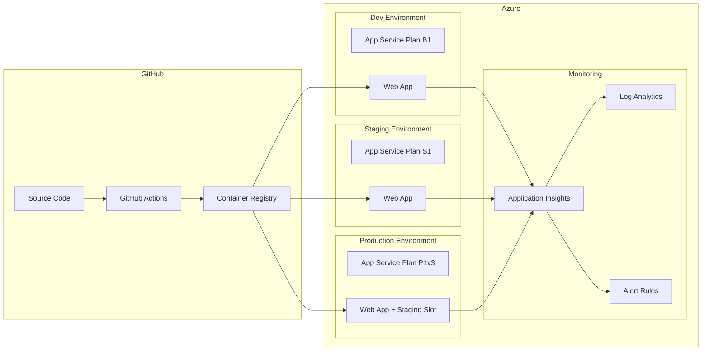

# Sales Portal Infrastructure

This directory contains the Infrastructure as Code (IaC) for deploying the Sales Portal application to Azure using Bicep templates.

## Quick Start

The fastest way to set up the infrastructure is to use the automated setup script:

```bash
# Full setup: resource groups, service principal, federated credentials
pnpm infra:setup

# Or run individual steps:
pnpm infra:setup:rg      # Create resource groups only
pnpm infra:setup:sp      # Create service principal only
pnpm infra:setup:creds   # Create federated credentials only
```

After running the setup script, follow the output instructions to add the required secrets to your GitHub repository.

## Architecture Overview



## Directory Structure

```
infra/
├── main.bicep                    # Main orchestration template
├── modules/
│   ├── appServicePlan.bicep      # App Service Plan module
│   ├── webApp.bicep              # Web App module
│   ├── applicationInsights.bicep # Application Insights & Log Analytics
│   └── alertRules.bicep          # Azure Monitor alert rules
├── parameters/
│   ├── dev.bicepparam            # Development parameters
│   ├── staging.bicepparam        # Staging parameters
│   └── prod.bicepparam           # Production parameters
├── scripts/
│   ├── setup.sh                  # Automated Azure setup script
│   ├── deploy.sh                 # Manual deployment script
│   └── validate.sh               # Template validation script
├── environment-variables.md      # 📋 Complete env vars reference
├── local-development.md          # 💻 Local dev setup (wildcard domains)
└── README.md                     # This file
```

> 📋 **Looking for environment variables?** See [environment-variables.md](./environment-variables.md) for the complete reference of all GitHub secrets, variables, and Azure settings.

> 💻 **Setting up local development?** See [local-development.md](./local-development.md) for wildcard domain setup with dnsmasq.

## Available Scripts

The following pnpm scripts are available for infrastructure management:

| Script                      | Description                                   |
| --------------------------- | --------------------------------------------- |
| `pnpm infra:setup`          | Full Azure setup (resource groups, SP, creds) |
| `pnpm infra:setup:rg`       | Create resource groups only                   |
| `pnpm infra:setup:sp`       | Create service principal only                 |
| `pnpm infra:setup:creds`    | Create federated credentials only             |
| `pnpm infra:deploy`         | Manual deployment (requires arguments)        |
| `pnpm infra:deploy:dev`     | Deploy to development (requires --image)      |
| `pnpm infra:deploy:staging` | Deploy to staging (requires --image)          |
| `pnpm infra:deploy:prod`    | Deploy to production (requires --image)       |
| `pnpm infra:validate`       | Validate Bicep syntax                         |
| `pnpm infra:validate:build` | Build Bicep to ARM JSON                       |

## Prerequisites

### Required Tools

1. **Azure CLI**: Install from https://docs.microsoft.com/cli/azure/install-azure-cli
2. **Azure Subscription**: An active Azure subscription with sufficient permissions

### Authentication

Before running any scripts, authenticate with Azure:

```bash
# Login to Azure
az login

# Verify you're in the correct subscription
az account show

# (Optional) Switch subscription if needed
az account set --subscription <subscription-id>
```

## Step-by-Step Setup Guide

### Step 1: Run the Automated Setup Script

The setup script will create all Azure resources needed for deployments:

```bash
pnpm infra:setup
```

This script performs the following:

1. Creates resource groups for dev, staging, and prod environments
2. Creates an App Registration (Service Principal) for GitHub Actions
3. Assigns Contributor role to all resource groups
4. Creates federated credentials for OIDC authentication

**Expected Output:**

```
=============================================================================
  Sales Portal - Azure Infrastructure Setup
=============================================================================

[INFO] Getting Azure subscription information...

Current Azure subscription:
  Name: Your Subscription Name
  ID: xxxxxxxx-xxxx-xxxx-xxxx-xxxxxxxxxxxx
  Tenant ID: xxxxxxxx-xxxx-xxxx-xxxx-xxxxxxxxxxxx

[INFO] Creating resource groups for each environment...
[SUCCESS] Resource group rg-sales-portal-dev ready
[SUCCESS] Resource group rg-sales-portal-staging ready
[SUCCESS] Resource group rg-sales-portal-prod ready

[INFO] Creating service principal for GitHub Actions...
[SUCCESS] App Registration created with ID: xxxxxxxx-xxxx-xxxx-xxxx-xxxxxxxxxxxx

[SUCCESS] Created federated credential: github-main
[SUCCESS] Created federated credential: github-tags
...
```

### Step 2: Configure GitHub Secrets

After running the setup script, add the following secrets to your GitHub repository:

**Navigate to:** Repository Settings → Secrets and variables → Actions → Secrets

#### Required Repository Secrets

These secrets are shared across all environments:

| Secret                  | Description                       | How to Get Value         |
| ----------------------- | --------------------------------- | ------------------------ |
| `AZURE_CLIENT_ID`       | Service Principal App (Client) ID | Output from setup script |
| `AZURE_TENANT_ID`       | Azure AD Tenant ID                | Output from setup script |
| `AZURE_SUBSCRIPTION_ID` | Target Azure Subscription ID      | Output from setup script |

**How to add a repository secret:**

1. Go to your GitHub repository
2. Click **Settings** tab
3. In the left sidebar, click **Secrets and variables** → **Actions**
4. Click **New repository secret**
5. Enter the secret name and value
6. Click **Add secret**

#### Optional Environment Secrets

These secrets can be configured per GitHub Environment if needed:

| Secret                 | Description                        | How to Get Value             |
| ---------------------- | ---------------------------------- | ---------------------------- |
| `GEINS_TENANT_API_KEY` | Geins Tenant API key (server-only) | Geins admin portal           |
| `REDIS_URL`            | Redis connection URL               | From your Redis provider     |
| `SENTRY_DSN`           | Sentry DSN for error tracking      | From Sentry project settings |
| `SENTRY_AUTH_TOKEN`    | Sentry auth token for source maps  | From Sentry auth tokens page |

**How to add an environment secret:**

1. Go to your GitHub repository
2. Click **Settings** tab
3. In the left sidebar, click **Environments**
4. Select the environment (e.g., `dev`, `staging`, `prod`)
5. Under **Environment secrets**, click **Add secret**
6. Enter the secret name and value
7. Click **Add secret**

### Step 3: Configure GitHub Variables (Optional)

**Navigate to:** Repository Settings → Secrets and variables → Actions → Variables

| Variable               | Description                        | Default Value                  |
| ---------------------- | ---------------------------------- | ------------------------------ |
| `GEINS_API_ENDPOINT`   | Geins GraphQL API endpoint         | `https://api.geins.io/graphql` |
| `GEINS_TENANT_API_URL` | Geins Tenant API URL (server-only) | (empty)                        |
| `STORAGE_DRIVER`       | Storage driver (`fs` or `redis`)   | `fs`                           |
| `ENABLE_ANALYTICS`     | Enable analytics                   | `false`                        |
| `LOG_LEVEL`            | Log level (`silent` to disable)    | `info`                         |
| `SENTRY_ORG`           | Sentry organization slug           | (empty - Sentry disabled)      |
| `SENTRY_PROJECT`       | Sentry project slug                | (empty - Sentry disabled)      |

### Step 4: Create GitHub Environments

**Navigate to:** Repository Settings → Environments

Create the following environments:

| Environment | Purpose                       | Protection Rules  |
| ----------- | ----------------------------- | ----------------- |
| `dev`       | Development deployments       | None (optional)   |
| `staging`   | Pre-production testing        | None (optional)   |
| `prod`      | Production deployment         | Require reviewers |
| `prod-swap` | Production slot swap approval | Require reviewers |

**For `prod` and `prod-swap` environments, configure:**

1. Click **Add rule** → **Require reviewers**
2. Add designated team members as reviewers
3. (Optional) Add deployment branch restrictions to `main` branch only

### Step 5: Verify Setup

Run the validation script to ensure templates are correct:

```bash
pnpm infra:validate
```

## Manual Azure Setup (Alternative)

If you prefer to set up Azure resources manually instead of using the setup script:

### 1. Create Resource Groups

```bash
az group create --name rg-sales-portal-dev --location westeurope
az group create --name rg-sales-portal-staging --location westeurope
az group create --name rg-sales-portal-prod --location westeurope
```

### 2. Create Service Principal with Federated Credentials

```bash
# Create App Registration
az ad app create --display-name "sales-portal-github-actions"

# Get App ID
APP_ID=$(az ad app list --display-name "sales-portal-github-actions" --query "[0].appId" -o tsv)

# Create Service Principal
az ad sp create --id $APP_ID

# Get Object ID
OBJECT_ID=$(az ad sp list --filter "appId eq '$APP_ID'" --query "[0].id" -o tsv)

# Assign Contributor role to resource groups
SUBSCRIPTION_ID=$(az account show --query id -o tsv)

az role assignment create --assignee $OBJECT_ID --role "Contributor" \
  --scope "/subscriptions/${SUBSCRIPTION_ID}/resourceGroups/rg-sales-portal-dev"
az role assignment create --assignee $OBJECT_ID --role "Contributor" \
  --scope "/subscriptions/${SUBSCRIPTION_ID}/resourceGroups/rg-sales-portal-staging"
az role assignment create --assignee $OBJECT_ID --role "Contributor" \
  --scope "/subscriptions/${SUBSCRIPTION_ID}/resourceGroups/rg-sales-portal-prod"
```

### 3. Configure Federated Credentials

Replace `geins-io/sales-portal` with your actual repository name:

```bash
# For main branch (staging deployments)
az ad app federated-credential create --id $APP_ID --parameters '{
  "name": "github-main",
  "issuer": "https://token.actions.githubusercontent.com",
  "subject": "repo:geins-io/sales-portal:ref:refs/heads/main",
  "audiences": ["api://AzureADTokenExchange"]
}'

# For tags (production deployments)
az ad app federated-credential create --id $APP_ID --parameters '{
  "name": "github-tags",
  "issuer": "https://token.actions.githubusercontent.com",
  "subject": "repo:geins-io/sales-portal:ref:refs/tags/*",
  "audiences": ["api://AzureADTokenExchange"]
}'

# For environment approvals
for env in dev staging prod prod-swap; do
  az ad app federated-credential create --id $APP_ID --parameters "{
    \"name\": \"github-env-${env}\",
    \"issuer\": \"https://token.actions.githubusercontent.com\",
    \"subject\": \"repo:geins-io/sales-portal:environment:${env}\",
    \"audiences\": [\"api://AzureADTokenExchange\"]
  }"
done
```

### 4. Get Values for GitHub Secrets

```bash
echo "AZURE_CLIENT_ID: $APP_ID"
echo "AZURE_TENANT_ID: $(az account show --query tenantId -o tsv)"
echo "AZURE_SUBSCRIPTION_ID: $(az account show --query id -o tsv)"
```

## Deployment Flow

```
┌─────────────────────────────────────────────────────────────────────────┐
│                           GitHub Actions                                 │
├─────────────────────────────────────────────────────────────────────────┤
│                                                                          │
│   ┌─────────────┐     ┌─────────────┐     ┌─────────────┐              │
│   │ Push to any │────▶│   Build &   │────▶│   Push to   │              │
│   │   branch    │     │    Test     │     │    GHCR     │              │
│   └─────────────┘     └─────────────┘     └──────┬──────┘              │
│                                                   │                      │
│   ┌─────────────────────────────────────────────┴─────────────────────┐│
│   │                                                                    ││
│   │  ┌──────────────┐    ┌──────────────┐    ┌──────────────┐        ││
│   │  │  Dev (manual)│    │   Staging    │    │  Production  │        ││
│   │  │ workflow_    │    │ push to main │    │   v* tags    │        ││
│   │  │   dispatch   │    │              │    │              │        ││
│   │  └──────┬───────┘    └──────┬───────┘    └──────┬───────┘        ││
│   │         │                    │                   │                ││
│   │         ▼                    ▼                   ▼                ││
│   │  ┌──────────────┐    ┌──────────────┐    ┌──────────────┐        ││
│   │  │  Azure Dev   │    │Azure Staging │    │ Azure Prod   │        ││
│   │  │  (B1 tier)   │    │  (S1 tier)   │    │ (P1v3 tier)  │        ││
│   │  └──────────────┘    └──────────────┘    └──────┬───────┘        ││
│   │                                                  │                ││
│   │                                           ┌──────▼───────┐        ││
│   │                                           │  Slot Swap   │        ││
│   │                                           │  (approval)  │        ││
│   │                                           └──────────────┘        ││
│   └───────────────────────────────────────────────────────────────────┘│
└─────────────────────────────────────────────────────────────────────────┘
```

## Manual Deployment

### Using pnpm Scripts

```bash
# Deploy to development
pnpm infra:deploy:dev -- --image ghcr.io/geins-io/sales-portal:dev

# Deploy to staging
pnpm infra:deploy:staging -- --image ghcr.io/geins-io/sales-portal:main

# Deploy to production
pnpm infra:deploy:prod -- --image ghcr.io/geins-io/sales-portal:v1.0.0

# Preview changes without deploying (what-if)
pnpm infra:deploy -- --env dev --image ghcr.io/geins-io/sales-portal:dev --what-if
```

### Using Azure CLI Directly

```bash
az deployment group create \
  --resource-group rg-sales-portal-dev \
  --template-file infra/main.bicep \
  --parameters infra/parameters/dev.bicepparam \
  --parameters containerImage="ghcr.io/geins-io/sales-portal:dev" \
               ghcrUsername="<github-username>" \
               ghcrToken="<github-pat>"
```

### Validate Templates

```bash
# Validate Bicep syntax
pnpm infra:validate

# Build Bicep to ARM JSON
pnpm infra:validate:build

# What-if deployment (preview changes)
pnpm infra:validate -- --env dev
```

## Environment Configuration

### SKU Tiers by Environment

| Environment | App Service Plan | Instances | Features                      |
| ----------- | ---------------- | --------- | ----------------------------- |
| Dev         | B1 (Basic)       | 1         | Cost-effective development    |
| Staging     | S1 (Standard)    | 1         | Production-like testing       |
| Prod        | P1v3 (Premium)   | 2         | Zone redundancy, staging slot |

## Environment Variables

> 📋 **See [environment-variables.md](./environment-variables.md) for the complete reference.**

### Quick Summary

| Where                 | What to Set                                                                                                                           |
| --------------------- | ------------------------------------------------------------------------------------------------------------------------------------- |
| **GitHub Secrets**    | `AZURE_CLIENT_ID`, `AZURE_TENANT_ID`, `AZURE_SUBSCRIPTION_ID`, `GEINS_TENANT_API_KEY`, `REDIS_URL`, `SENTRY_DSN`, `SENTRY_AUTH_TOKEN` |
| **GitHub Variables**  | `GEINS_API_ENDPOINT`, `GEINS_TENANT_API_URL`, `STORAGE_DRIVER`, `ENABLE_ANALYTICS`, `LOG_LEVEL`, `SENTRY_ORG`, `SENTRY_PROJECT`       |
| **Azure App Service** | ⚠️ Don't set manually - Bicep handles this automatically                                                                              |

### How It Works

1. You set variables in **GitHub** (Secrets for sensitive, Variables for config)
2. The **deploy.yml** workflow passes them to **Bicep**
3. **Bicep** sets them in Azure with the correct `NUXT_*` prefix
4. **Nuxt** picks them up at runtime

```
GitHub Variable          →  Bicep Parameter    →  Azure App Setting
───────────────────────────────────────────────────────────────────
GEINS_API_ENDPOINT       →  geinsApiEndpoint   →  NUXT_GEINS_API_ENDPOINT
GEINS_TENANT_API_URL     →  geinsTenantApiUrl  →  NUXT_GEINS_TENANT_API_URL
GEINS_TENANT_API_KEY     →  geinsTenantApiKey  →  NUXT_GEINS_TENANT_API_KEY
STORAGE_DRIVER           →  storageDriver      →  NUXT_STORAGE_DRIVER
REDIS_URL                →  redisUrl           →  NUXT_STORAGE_REDIS_URL
```

## Re-running Setup

If you need to re-run the setup (e.g., after accidentally deleting resources or updating to a new repository):

```bash
# Full re-setup
pnpm infra:setup

# Or run specific parts:
pnpm infra:setup --skip-rg       # Skip resource group creation
pnpm infra:setup --skip-sp       # Skip service principal creation
pnpm infra:setup --skip-creds    # Skip federated credentials creation

# Update GitHub repository reference
GITHUB_REPOSITORY=your-org/your-repo pnpm infra:setup --creds-only
```

## Troubleshooting

### Common Issues

#### 1. "You are not logged in to Azure"

```bash
# Login to Azure
az login

# Or for service principal authentication:
az login --service-principal -u <client-id> -p <client-secret> --tenant <tenant-id>
```

#### 2. "Insufficient privileges to complete the operation"

You need one of these Azure AD roles:

- **Application Administrator** - to create App Registrations
- **Global Administrator** - full access

Or ask your Azure AD admin to run the setup script for you.

#### 3. "Container fails to start"

```bash
# Check container logs
az webapp log tail --resource-group rg-sales-portal-dev --name sales-portal-dev-app

# View recent logs
az webapp log download --resource-group rg-sales-portal-dev --name sales-portal-dev-app
```

#### 4. "Deployment fails with authentication error"

- Verify federated credentials are configured correctly
- Check that the GitHub environment matches the credential subject
- Ensure the repository name in federated credentials matches your actual repository

#### 5. "GHCR pull fails"

- Ensure `GITHUB_TOKEN` has `packages:read` permission
- Verify the image exists in the registry:
  ```bash
  docker manifest inspect ghcr.io/geins-io/sales-portal:main
  ```

### Useful Commands

```bash
# List deployments
az deployment group list --resource-group rg-sales-portal-dev

# Show deployment details
az deployment group show --resource-group rg-sales-portal-dev --name main

# Restart web app
az webapp restart --resource-group rg-sales-portal-dev --name sales-portal-dev-app

# View app settings
az webapp config appsettings list --resource-group rg-sales-portal-dev --name sales-portal-dev-app

# View federated credentials
az ad app federated-credential list --id <app-id>

# Delete and recreate a federated credential
az ad app federated-credential delete --id <app-id> --federated-credential-id github-main
```

## Monitoring & Alerting

The infrastructure includes comprehensive monitoring through Azure Application Insights and Log Analytics.

### Components

| Component            | Description                                      | Environment  |
| -------------------- | ------------------------------------------------ | ------------ |
| Application Insights | APM, telemetry, and error tracking               | All          |
| Log Analytics        | Centralized log storage and querying             | All          |
| Availability Tests   | Health endpoint monitoring from multiple regions | Staging/Prod |
| Alert Rules          | Proactive notifications for issues               | Staging/Prod |

### Alert Rules

The following alerts are configured for staging and production:

| Alert               | Threshold                    | Severity | Description                  |
| ------------------- | ---------------------------- | -------- | ---------------------------- |
| High Response Time  | > 2s (prod) / 3s (staging)   | Warning  | Average server response time |
| High Failure Rate   | > 5% (prod) / 10% (staging)  | Error    | Request failure percentage   |
| Server Errors       | > 3 (prod) / 5 (staging)     | Critical | 5xx error count in 5 minutes |
| High CPU            | > 80% (prod) / 85% (staging) | Warning  | CPU utilization              |
| High Memory         | > 80% (prod) / 85% (staging) | Warning  | Memory utilization           |
| Availability Failed | < 80%                        | Critical | Health check availability    |

### Configuring Alert Notifications

To receive alert notifications, provide email addresses via the `alertEmails` parameter:

```bash
# In deployment
az deployment group create \
  --resource-group rg-sales-portal-prod \
  --template-file infra/main.bicep \
  --parameters infra/parameters/prod.bicepparam \
  --parameters alertEmails='["alerts@example.com", "oncall@example.com"]'
```

### Log Retention & Data Caps

| Environment | Retention | Daily Cap | Purpose                        |
| ----------- | --------- | --------- | ------------------------------ |
| Dev         | 30 days   | 1 GB      | Cost-effective development     |
| Staging     | 30 days   | 1 GB      | Pre-production testing         |
| Prod        | 90 days   | 10 GB     | Compliance and troubleshooting |

### Accessing Logs

**Via Azure Portal:**

1. Navigate to your Application Insights resource
2. Click **Logs** to query using Kusto Query Language (KQL)

**Common queries:**

```kql
// Recent errors
exceptions
| where timestamp > ago(1h)
| order by timestamp desc

// Request performance
requests
| where timestamp > ago(1h)
| summarize avg(duration), percentile(duration, 95) by bin(timestamp, 5m)

// Failed requests by endpoint
requests
| where success == false
| summarize count() by name
| order by count_ desc
```

### Disabling Monitoring

To disable monitoring (e.g., for cost savings in dev), set `enableMonitoring` to `false`:

```bash
az deployment group create \
  --parameters enableMonitoring=false
```

## Security Considerations

1. **Managed Identity**: Each Web App has a system-assigned managed identity for secure Azure resource access
2. **HTTPS Only**: All Web Apps enforce HTTPS
3. **TLS 1.2+**: Minimum TLS version is 1.2
4. **FTPS Disabled**: FTP/FTPS is disabled for security
5. **Non-root Container**: The Docker container runs as a non-root user
6. **Secrets in Azure**: Sensitive values are stored as App Service application settings (encrypted at rest)
7. **OIDC Authentication**: GitHub Actions use OIDC (federated credentials) - no secrets stored in GitHub

## Cost Optimization

| Environment | Estimated Monthly Cost | Notes                             |
| ----------- | ---------------------- | --------------------------------- |
| Dev         | ~$13/month             | B1 tier, no Always On             |
| Staging     | ~$73/month             | S1 tier, Always On enabled        |
| Production  | ~$120/month            | P1v3 tier, zone redundancy, slots |

**Cost Saving Tips:**

- Use Azure Reserved Instances for production workloads (up to 65% savings)
- Shut down dev environment during non-working hours
- Use Azure Cost Management to set budgets and alerts
